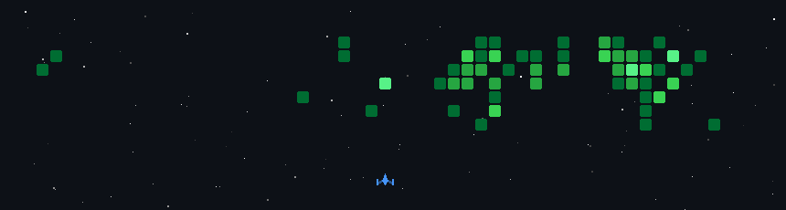

## Ciao 👋, sono Francesco Rainone!

In questo spazio condivido i miei progetti in cui sperimento nuove tecnologie per realizzare le mie idee.  
Il mio obiettivo è crescere come Full Stack Developer, mantenendo però un approccio aperto e curioso: amo esplorare nuovi linguaggi e strumenti per arricchire continuamente le mie competenze.

---

### 👾 La Battaglia dei Commit
*Chi ha detto che le statistiche di GitHub devono essere noiose?*

**GitHub Space Shooter:** Grazie a un'automazione via GitHub Actions, trasformo ogni giorno il mio grafico dei contributi in una battaglia arcade. Ogni nemico distrutto rappresenta il lavoro svolto: più "green squares" accumulo, più la battaglia si fa intensa!

---

### 🔭 Progetti in Primo Piano

<table>
  <tr>
    <td width="50%" valign="top">
      <h3>🌿 Livingdex</h3>
      

        <strong>L'AI incontra la natura.</strong> Un'applicazione mobile sviluppata in Flutter che integra <strong>Gemini 2.0 Flash</strong> per trasformare lo smartphone in un vero Pokédex del mondo reale. 
          
        Identifica specie vegetali e animali istantaneamente, incentivando l'esplorazione e la curiosità verso l'ambiente circostante attraverso un'interfaccia iconica e nostalgica.
      

      

        <a href="https://github.com/Francesco-rainone/Livingdex"><b>📂 Codice</b></a> | 
        <a href="https://youtu.be/Rmdl-78N8U4"><b>📺 Video Demo</b></a>
      

    </td>
    <td width="50%" valign="top">
      <h3>⚡ Classic Pokedex</h3>
      

        <strong>Reattività e Design.</strong> Una Web App in React che interroga le <i>PokeAPI</i> per offrire un'esperienza di ricerca fluida sui primi 151 Pokémon.
          
        Focus sulla gestione dinamica dello stato, filtraggio avanzato per tipo e statistiche, e un layout responsive curato per un'esperienza utente impeccabile.
      

      

        <a href="https://github.com/Francesco-rainone/pokedex"><b>📂 Codice</b></a>
      

    </td>
  </tr>
</table>

---

### 🛠️ Il mio Arsenale Tecnico

#### 🌐 Frontend & Mobile

  
  
  
  

#### ⚙️ Backend & Database

  
  
  

#### 🔧 Tools & Workflow

  
  
  

---

### 📫 Entriamo in contatto!

Sono sempre aperto a nuove sfide tecnologiche, collaborazioni su progetti AI o una chiacchierata sullo sviluppo Full Stack.

* 📧 **Email:** [francesco.rainone@itstechtalentfactory.it](mailto:francesco.rainone@itstechtalentfactory.it)
* 💼 **LinkedIn:** [Francesco Rainone](https://www.linkedin.com/in/francesco-rainone-048560286)
* 👨‍💻 **GitHub:** Se i miei progetti ti piacciono, lascia una ⭐!

---

  <i>"Il codice è come l'umorismo. Se devi spiegarlo, non è venuto bene."</i>

